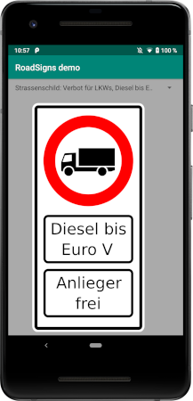

[](https://travis-ci.org/Umweltzone/roadsigns) [](https://bintray.com/tbsprs/maven/roadsigns/_latestVersion) [](http://choosealicense.com/licenses/apache-2.0/) [][jitpack-roadsigns]

# Road signs library

A Kotlin library hosting a custom view for road signs.

The demo application allows selecting the different road signs.




## Supported languages
- English 🇺🇸
- German 🇩🇪
- Portuguese 🇵🇹
- Spanish 🇪🇸
- Swedish 🇸🇪


## Gradle build

To deploy the library to your local Maven repository run the following task:

```bash
$ ./gradlew publishToMavenLocal
```

Then, to use the library in your project add `mavenLocal()` to
your top level `build.gradle`:

```
allprojects {
    repositories {
        mavenLocal()
        mavenCentral()
    }
}
```

and to your application module `build.gradle`:


```groovy
dependencies {
    implementation "info.metadude.kotlin.library.roadsigns:roadsigns:$version"
}
```

Alternatively, you can use [JitPack][jitpack-roadsigns] to fetch and
build the sources directly from [this repository][github-roadsigns].


## Author

* [Tobias Preuss][tobias-preuss]


## Contributors

* [Fredrik Henricsson](https://github.com/fejd)
* [Thiago de Oliveira Pires](https://github.com/tdopires)


## License

    Copyright 2019-2020 Tobias Preuss

    Licensed under the Apache License, Version 2.0 (the "License");
    you may not use this file except in compliance with the License.
    You may obtain a copy of the License at

       http://www.apache.org/licenses/LICENSE-2.0

    Unless required by applicable law or agreed to in writing, software
    distributed under the License is distributed on an "AS IS" BASIS,
    WITHOUT WARRANTIES OR CONDITIONS OF ANY KIND, either express or implied.
    See the License for the specific language governing permissions and
    limitations under the License.


[github-roadsigns]: https://github.com/Umweltzone/roadsigns
[jitpack-roadsigns]: https://jitpack.io/#Umweltzone/roadsigns
[tobias-preuss]: https://github.com/johnjohndoe
